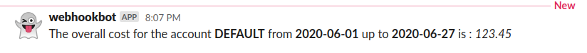

# AWS billing scheduled Bot for Slack

Simple AWS Lambda powered Slack bot that reports your AWS Costs for the current month to a channel

* Fully customizable schedule
* Simple setup
* Lightweight

## Getting Started:

### Requirements:
* AWS cli
* Node 12+*
    * Serverless Framework  ( `npm i -g serverless` )
* Python 3
* A Slack Webhook URL [How to setup a Slack Webhook](https://api.slack.com/messaging/webhooks)

*Lower versions should work too, at least from 8+, just haven't tested

### Deploying:
* Install Node requirements, `npm i`
* Install python requirements, `pip3 install -r requirements.txt`
* **Update the `main.py` file using your credentials;**
* Check if you need to update the region on the `serverless.yml` file¹
* Deploy by running `sls deploy`²

1.  This just defines where the lambda function will live, the costs retrieved are always accountwide
2.  This configuration should straight up work, but if you need to tweak something regarding the serverless configuration,  [check the Serverless Variables and Docs](https://www.serverless.com/framework/docs/providers/aws/guide/variables/)

### FAQ
* **Why does my cost show up as negative ?**
* You are probably using Credits, so the Cost Explorer API will return a negative number; This may be handled on a future release;

* **How do I test this without waiting for the Scheduled Event to call the Lambda ?**
* You can simply test the lambda, with any test event, using the AWS Console;

* **Why dont you use Environment Variables ?**
* The ideia is to be as straightforward as possible; The code is so tiny that you could update it straight from the AWS console itself;

